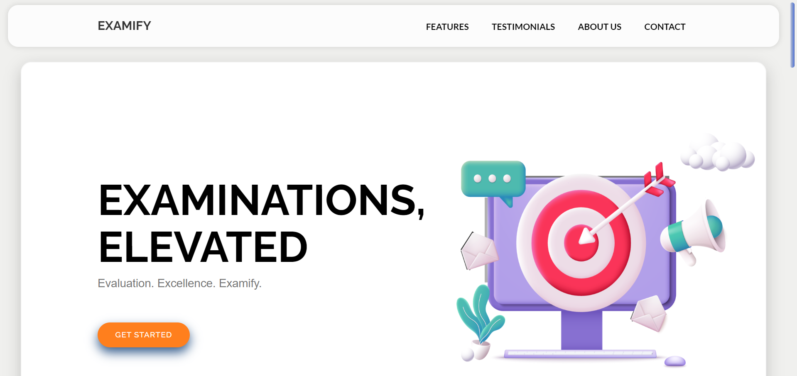
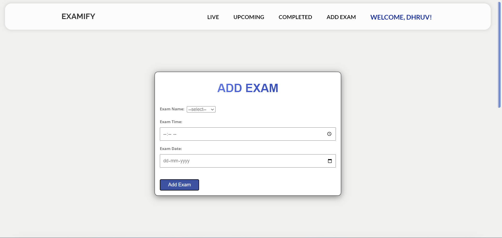
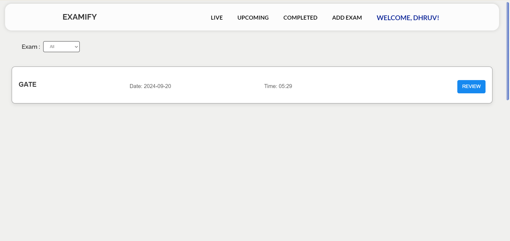

# Examify 🎓📚

**Examify** is a MERN stack-based platform designed to conduct **MCQ-based exams**. It currently supports **JEE, CAT, and GATE exams**, offering a **free resource** for students to practice mock exams. Institutions can also leverage Examify to organize formal exams, providing a comprehensive tool for online assessments.

## 📋 Table of Contents
1. [Features](#features)
2. [Technologies Used](#technologies-used)
3. [Installation](#installation)
   - [Prerequisites](#prerequisites)
   - [Setup Guide](#setup-guide)
4. [Screenshots](#screenshots)
5. [Contribution](#contribution)
6. [License](#license)

## 🚀 Features

- **📅 Real-time MCQ Exams**: Conduct multiple-choice exams with set time limits, automatic scoring, and instant results.
- **🚨 Cheating Detection**: Track tab switching and auto-submit the exam after multiple warnings, ensuring fair examination.
- **💻 Responsive UI**: Designed for both students and institutions, with a user-friendly interface focused on accessibility and simplicity.

## 🛠️ Technologies Used

- **Frontend**: React.js ⚛️
- **Backend**: Node.js, Express.js 🛠️
- **Database**: MongoDB 🍃
- **Other**: Tailwind CSS for styling 🎨, JWT for authentication 🔒

## 💻 Installation

Follow these steps to set up Examify on your local machine.

### Prerequisites

- **Node.js** (v14+)
- **MongoDB**
- **Git**
- **npm** or **yarn**

### 🚧 Setup Guide

1. **Clone the repository:**
   ```bash
   git clone https://github.com/janvikapadia/Examify.git
   cd examify
   ```

2. **Install dependencies:**


   - **Backend**:
     ```bash
     cd backend
     npm install
     npm install express mongoose nodemon bcryptjs jsonwebtoken cors dotenv cookie-parser axios
     ```

   - **Frontend**:
     ```bash
     cd ../frontend
     npm install
     npm install axios react-router-dom react-toastify@8.1.0 react-google-recaptcha
     ```

3. **Configure environment variables:**


   In the `backend` folder, create a `.env` file and add the following:
   ```bash
   MONGO_URI = your_mongodb_uri
   PORT = 5000
   KEY = jwttokenkey
   Email = sender_email
   PASS = sender_password
   ```

   📨 **Email Setup**:
    - Update `sender_email` and `sender_password` in **.env**.
    - Watch this [tutorial](https://youtube.com/shorts/n9Ooxum-iUo?si=uwrhEo26S_Qj9zsC) for guidance. (In python but same for MERN also)

4. **Run the project**:

   - **Start the backend server**:
     ```bash
     cd backend
     npm start
     ```

   - **Start the frontend server**:
     ```bash
     cd ../frontend
     npm start
     ```

5. **Access the application**:

   - Frontend: [http://localhost:3000](http://localhost:3000) 🌐
   - Backend: [http://localhost:5000](http://localhost:5000) 🚀

## 📸 Screenshots

### 1. Home Page


### 2. Admin Interface





### 3. Student Interface


### 4. Cheating Detection Warning


## 🤝 Contribution

Feel free to **fork** the repository, make changes, and submit a pull request. Contributions are welcome! 🌟

## 📄 License

This project is licensed under the **MIT License** – see the [LICENSE](LICENSE) file for details.
